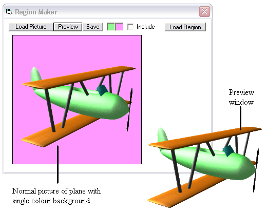



## Region Maker \(updated\): Create, Save and Load the appearance of your forms\!

### Description

Region Maker is an extremely useful and powerful tool that can completely re-shape forms. See the screenshot for an example. Both tool and module allow you to create a window shaped to your desire from a bitmap image, save the data, and re-use it later. All you have to do is create the region data file, which the module or tool does for you, and then call two functions within your program to change what your window looks like completely. All unwanted areas become transparent so you can make all of your programs look the way YOU want them to!
 
### More Info
 

             |
---                |---
**Submitted On**   |2003-07-05 19:48:24
**By**             |[Craig Bonathan](https://github.com/Planet-Source-Code/PSCIndex/blob/master/ByAuthor/craig-bonathan.md)
**Level**          |Advanced
**User Rating**    |4.5 (18 globes from 4 users)
**Compatibility**  |VB 5\.0, VB 6\.0
**Category**       |[Graphics](https://github.com/Planet-Source-Code/PSCIndex/blob/master/ByCategory/graphics__1-46.md)
**World**          |[Visual Basic](https://github.com/Planet-Source-Code/PSCIndex/blob/master/ByWorld/visual-basic.md)
**Archive File**   |[Region\_Mak161050762003\.zip](https://github.com/Planet-Source-Code/craig-bonathan-region-maker-updated-create-save-and-load-the-appearance-of-your-forms__1-46682/archive/master.zip)

